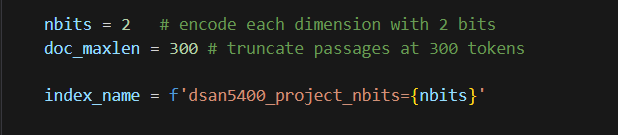

# news_recommendation_final_project
By: Nadav Gerner, Dominic Vogel, Jared Zirkes, Shingai Nindi

A project for creating and offering news article recommendations to broaden readers' universe of news media. The project pulls from a variety of news sources and implements ColBERT to analyze text similarity between an input article and the collected corpus of articles. Once an article is input, the 5 most similar articles (scored by ColBERT) are returned with titles, source, and URL. These articles are also analyzed using a BERT sentiment model and are given a sentiment score 1-5 (5 being the most postiive). These article recommendations and sentiment scores are intended to be a great way to broaden a user's exposure to different outlets. Reading similar articles with a different sentiment than the input help show differing opinions on a specific topic of interest.

## Installation

**NOTE: BEFORE RUNNING, ENSURE THAT ALL COLBERT DATA AND CHECKPOINTS ARE SUCCESFULLY INSTALLED**

To do so, copy and paste **in the terminal** the following lines:

```
!git -C ColBERT/ pull || git clone https://github.com/stanford-futuredata/ColBERT.git > /dev/null 2>&1
!wget "https://downloads.cs.stanford.edu/nlp/data/colbert/colbertv2/colbertv2.0.tar.gz"
!mkdir -p checkpoints  # Create the 'checkpoints' directory if it doesn't exist
!tar -xvzf colbertv2.0.tar.gz -C checkpoints
!pip install -U pip > /dev/null 2>&1
!pip install fsspec==2024.9.0 > /dev/null 2>&1
!pip install -e ColBert/['faiss-gpu','torch'] > /dev/null 2>&1
!pip install --upgrade torch torchvision torchaudtio > /dev/null 2>&1
```

```bash
pip install news_recommendation_final_project
```

## Usage

To use this project, run the main.py file. This invokes 3 function calls. The first takes a url of an article within our corpus and will return the titles, sources, and urls to the five most similar articles within our corpus scored by ColBERT.
From there, these articles will be passed through a text cleaning function that prepares the article text for sentiment analysis. From there, sentiment analysis will be run on the five returned articles from the first function call, scoring them from 1 (most negative) to 5 (most positive).

**NOTE This main.py file will not be able to complete its run unless you are running it on a machine with GPU processing available. If this is not the case, we recommend testing the functionality from the colab notebook here ([ColBERT implementation](DSAN_5400_Final_News_Recommender_Training.ipynb)).**

**NOTE Even if you have GPU processing available, you will still need to run the ([ColBERT implementation](DSAN_5400_Final_News_Recommender_Training.ipynb)) notebook up to the following chunk . This is because it creates an index with the trained model. Unfortunately, this model training was not able to be run locally on any of our laptops so we used colab for the entire process. If this is run, the proper index will be created locally, allowing for main.py to run.**


Picture above is an example of what is returned when our text similarity function is implemented correctly. If you want to try for yourself, you must enter an article contained within our corpus. Here are a few links to articles within our corpus if you are interested in trying for yourself:(https://www.aljazeera.com/program/between-us/2024/11/4/trumps-road-to-the-election

https://www.aljazeera.com/program/between-us/2024/11/4/harriss-road-to-the-election

https://www.aljazeera.com/news/2024/11/12/moldova-formally-protests-alleged-russian-election-meddling

https://www.aljazeera.com/news/2024/11/12/opposition-secures-landslide-victory-in-mauritius-election

https://www.aljazeera.com/program/now-you-know/2024/11/4/will-abortion-access-decide-the-us-election

https://www.aljazeera.com/news/2024/10/26/japans-parliamentary-election-why-it-matters

https://www.aljazeera.com/program/the-stream/2024/11/1/what-issues-are-americans-facing-this-election)

## Contributing

Clone and set up the repository with

```bash
git clone TODO && cd news_recommendation_final_project
pip install -e ".[dev]"
```

Install pre-commit hooks with

```bash
pre-commit install
```

Run tests using

```
pytest -v tests
```

